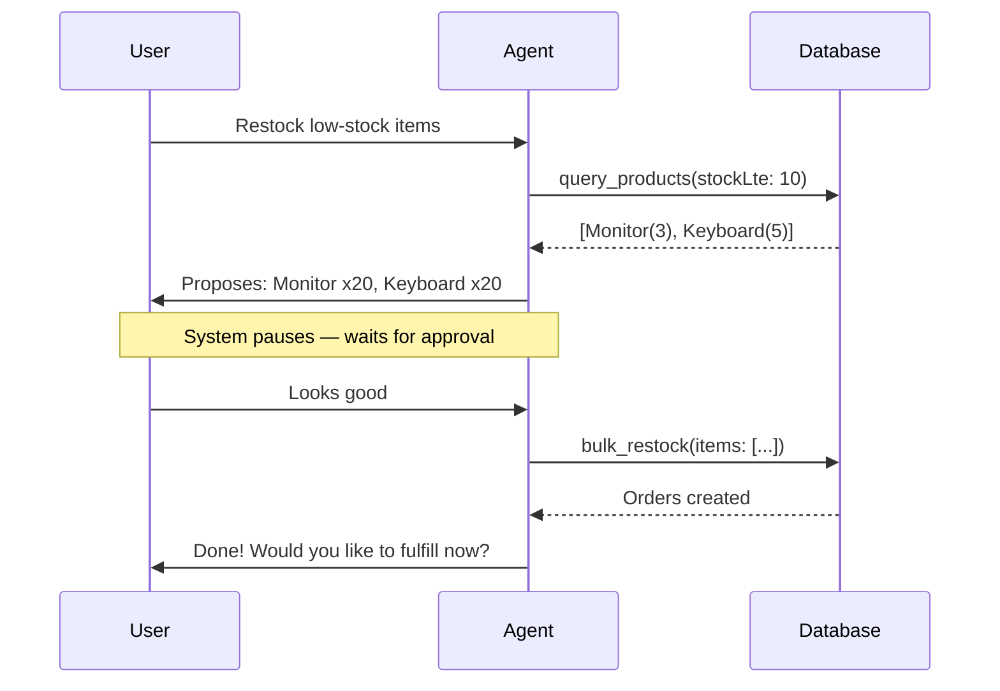

# AI Inventory Insights

An **AI-powered inventory and sales analytics platform** built with Next.js 16. Chat with an AI agent to query your sales data, monitor inventory levels, manage products, record sales, and automate restock orders — all in real time.

## Demo

<iframe width="560" height="315" src="https://youtu.be/HXO3q588wZI" frameborder="0" allowfullscreen></iframe>


## Tech Stack

| Layer | Technology |
|---|---|
| **Framework** | Next.js 16 (App Router) |
| **UI** | React 19, shadcn/ui, Tailwind CSS v4 |

| **Data Fetching** | TanStack React Query v5 |
| **Database** | SQLite via better-sqlite3 |
| **ORM** | Drizzle ORM |
| **AI SDK** | Vercel AI SDK v6 (ToolLoopAgent) |
| **AI Provider** | Groq (default), Ollama (optional) |
| **AI Model** | Llama 3.3 70B (configurable) |
| **Forms** | react-hook-form + Zod |
| **Markdown** | react-markdown + remark-gfm |
| **Icons** | Lucide React |

## Features

### AI Sales Analyst Agent

Talk to your data like you would a human analyst. The AI agent understands natural-language requests, queries your live database, and takes action — all through a resizable chat panel.

**What you can say:**

| You ask | The agent does |
|---------|---------------|
| *"What were my top products this quarter?"* | Queries revenue data, groups by product, returns a ranked table |
| *"Which products are low in stock?"* | Filters products by stock level, highlights what needs restocking |
| *"Yesterday's update"* | Single-call daily briefing: sales, orders, low stock, inventory, day-over-day comparison |
| *"Compare this month vs last month"* | Compares two periods side-by-side with revenue, count, and % change |
| *"Restock all low-stock electronics"* | Identifies low items, creates bulk orders — pauses for your approval |
| *"Fulfill order #3"* | Adds quantity to product stock, updates order status — pauses for your approval |

The agent has **8 filterable tools** — each accepts targeted parameters so it fetches exactly what's needed, not everything:

- **`query_products`** — Search/filter products by name, category, stock level, price range, or get aggregate summaries
- **`query_sales`** — Filter sales by date, category, product; group by day/week/month/product/category; drill into a specific sale
- **`query_orders`** — Filter restock orders by status, product, or date range
- **`compare_sales_periods`** — Compare revenue and sales count between two time periods
- **`get_daily_briefing`** — One-call daily snapshot: sales, top products, day-over-day comparison, pending orders, low stock, inventory
- **`restock_order` / `bulk_restock` / `fulfill_order`** — Mutations with user approval (single+batch restock, fulfillment)

#### Conversation Showcase

> **You:** *"What happened yesterday?"*
>
> **Agent:**
> ```text
> **📊 Yesterday's Briefing (2026-06-18)**
>
> **Sales** — $4,230.00 from 12 transactions
> Top products: Wireless Mouse ($980), USB-C Hub ($720), HDMI Cable ($410)
>
> **vs Previous Day** — +15.3% ($3,670.00 → $4,230.00)
>
> **Orders** — 2 pending (Monitor x5, Keyboard x10)
> 1 order created yesterday
>
> **Alerts** — 3 products below 10 stock
> ```
>
> **You:** *"Restock those 3 low-stock items with 20 units each."*
>
> **Agent:** *"I'll create orders for..."* (presents proposal)
> *Order #42: Monitor — qty 20*
> *Order #43: Keyboard — qty 20*
> *Order #44: Mouse Pad — qty 20*
>
> *System pauses for your approval...* ✅
>
> **You:** *"Looks good."*
>
> **Agent:** *"Orders created! Would you like to fulfill them now?"*

#### Mutation Flow with Approval

Restock and fulfill operations require user confirmation. The agent proposes, you approve — no accidental stock changes:



### Dashboard
KPI cards showing total revenue, total sales, top product, and low stock count. Quick-action chat panel always available.

### Products
Full CRUD for products with stock levels, prices, and categories. Low-stock items highlighted in red with a badge. Edit and delete with confirmation dialogs.

### Sales
Transaction history with date range and category filters. Click any sale to expand and view individual items. Record new sales (multi-item form with product select) or delete existing ones — stock is adjusted automatically.

### Restock Orders
Track all orders with statuses: pending, ordered, received, fulfilled, cancelled. Fulfill orders to add quantity back to product stock. Delete orders with protection against fulfilled deletions.

### Chat History
All conversations persisted in SQLite. Start a new chat, pick up where you left off, or browse past analyses. Chat titles are editable inline.

### Dark Mode
Full light/dark theme support via CSS custom properties. Respects system preference.

## Architecture

```
src/
├── app/
│   ├── api/
│   │   ├── chat/              # AI agent endpoint (ToolLoopAgent, 7 tools)
│   │   ├── sales/             # Sales list + create + detail + delete
│   │   ├── products/          # Product CRUD
│   │   ├── orders/            # Order CRUD + status updates
│   │   ├── chats/             # Chat history CRUD
│   │   └── dashboard/         # KPI data
│   ├── dashboard/             # Dashboard + Orders page
│   ├── products/              # Product CRUD page
│   ├── sales/                 # Sales history page
│   ├── layout.tsx             # Root layout (Geist fonts, Providers, AppLayout)
│   └── page.tsx               # Redirects to /dashboard
├── components/
│   ├── app-layout.tsx         # Resizable 3-column layout (nav + content + chat)
│   ├── providers.tsx          # TanStack Query provider
│   ├── chat/
│   │   ├── chat-panel.tsx     # Chat sidebar: history, input, messages, quick questions
│   │   └── chat-message.tsx   # Message bubbles with markdown
│   ├── dashboard/
│   │   ├── nav.tsx            # Top navigation bar
│   │   └── kpi-cards.tsx      # KPI card grid with loading skeletons
│   ├── products/
│   │   └── product-table.tsx  # Read-only product table
│   ├── sales/
│   │   └── sales-table.tsx    # Filterable sales table with expandable rows
│   └── ui/                    # shadcn/ui primitives (10 components)
├── db/
│   ├── schema.ts              # Drizzle schema (6 tables)
│   ├── queries.ts             # 31 query/command functions
│   ├── index.ts               # SQLite connection (WAL mode, foreign keys)
│   └── seed.ts                # Demo data (22 products, Jan–Jun 2026 sales)
├── hooks/
│   ├── use-dashboard.ts       # Dashboard KPIs query
│   ├── use-products.ts        # Products CRUD queries + mutations
│   ├── use-sales.ts           # Sales list + create + delete
│   ├── use-sale-detail.ts     # Single sale detail
│   ├── use-orders.ts          # Orders CRUD + fulfill
│   └── use-chats.ts           # Chat CRUD
├── lib/
│   ├── ai-tools.ts            # 7 AI tool definitions (4 query + 3 mutation)
│   ├── cache-invalidation.ts  # Mutation-to-cache-key mapping
│   └── utils.ts               # cn(), formatCurrency(), formatDate()
└── types/
    ├── chat.ts                # Chat interface
    ├── db.ts                  # Product, Order, SaleItem, SaleDetail, InventorySummary
    └── inventory.ts           # Duplicate Product + InventorySummary types
```

### Database Schema

- **products** — `id`, `name`, `category`, `price`, `stock`, `created_at`
- **sales** — `id`, `created_at`, `total`
- **sale_items** — `id`, `sale_id`, `product_id`, `quantity`, `unit_price`
- **orders** — `id`, `product_id`, `quantity`, `status` (pending/ordered/received/fulfilled/cancelled), `created_at`
- **chats** — `id`, `title`, `created_at`, `updated_at`
- **chat_messages** — `id`, `chat_id`, `message_id` (unique per chat), `role`, `content`, `created_at`

### AI Tools (8 total)

| Tool | Type | Purpose |
|---|---|---|
| `query_products` | Read | Search/filter products by name, category, stock range, price range; `summary` mode for aggregates |
| `query_sales` | Read | Filter sales by date, category, product; group by product/category/day/week/month; `saleId` for detail |
| `query_orders` | Read | Filter restock orders by status, product, or date range |
| `compare_sales_periods` | Read | Compare revenue and sales count between two time periods |
| `get_daily_briefing` | Read | Consolidated daily snapshot: sales, top products, day-over-day comparison, pending orders, created orders, low stock, inventory |
| `restock_order` | Mutate | Create a single restock order (requires user approval) |
| `bulk_restock` | Mutate | Create multiple restock orders at once (requires user approval) |
| `fulfill_order` | Mutate | Fulfill a pending order — adds quantity to product stock (requires user approval) |

### Agent Workflows

**Restock Flow:**
1. Agent calls `query_products({ stockLte: 10 })` to find low items, or user requests specific products
2. Calls `restock_order` (single) or `bulk_restock` (multi) — **system pauses automatically** for user approval
3. On approval → order is created; on denial → discarded
4. After success, agent asks: *"Would you like to fulfill it now?"*

**Fulfill Flow:**
1. Agent calls `query_orders({ status: "pending" })` to find fulfillable orders
2. Calls `fulfill_order` — **system pauses automatically** for user approval
3. On approval → status updates to "fulfilled" and quantity added to product stock

### Cache Invalidation
Mutation tools (`restock_order`, `bulk_restock`, `fulfill_order`) automatically invalidate relevant React Query caches (`orders`, `products`, `dashboard`) so the UI stays in sync after AI-driven changes.

## Getting Started

### Prerequisites

- Node.js 20+
- A Groq API key (free tier at groq.com)

### Setup

```bash
# 1. Install dependencies
npm install

# 2. Set up environment variables
cp .env.example .env.local
# Add your GROQ_API_KEY to .env.local

# 3. Run database migrations
npx drizzle-kit push

# 4. Seed the database with demo data (Jan–Jun 2026)
npx tsx src/db/seed.ts

# 5. Start dev server
npm run dev
```

Open [http://localhost:3000](http://localhost:3000) — you'll land on the Dashboard with the AI chat panel ready.

### Using Ollama (Optional)

If you prefer a local model, uncomment these in `.env.local`:

```env
AI_BASE_URL=http://localhost:11434/v1
AI_API_KEY=ollama
AI_MODEL=qwen3.5:4b
```

### Commands

| Command | Description |
|---|---|
| `npm run dev` | Start development server |
| `npm run build` | Production build |
| `npm run start` | Start production server |
| `npm run lint` | Run ESLint |
| `npx drizzle-kit push` | Apply migrations to database |
| `npx drizzle-kit generate` | Generate migration from schema changes |
| `npx tsx src/db/seed.ts` | Seed demo data (22 products, 6 months of sales) |

## Example Chat Queries

### Daily Check-Ins
- *"Yesterday's update"* / *"Morning briefing"*
- *"What happened on June 15?"*
- *"How are we doing today?"*

### Sales Analysis
- *"What were my top products this quarter?"*
- *"Show me sales by category"*
- *"Compare sales this month vs last month"*
- *"Which month had the highest revenue?"*
- *"Show me the breakdown of electronics sales by week"*
- *"What's in sale #42?"*

### Inventory Management
- *"Which products are low in stock?"*
- *"Show me the full inventory summary"*
- *"Search for monitor products"*
- *"What electronics do we have under $50?"*
- *"How many total units are in stock?"*

### Operations & Orders
- *"Any pending orders?"*
- *"Recent restock orders"*
- *"Show me orders for product #5"*
- *"Fulfill order #3"*
- *"Restock 10 units of Wireless Mouse"*
- *"Restock all low-stock items"*
- *"Restock 10 units of every product in Electronics"*
